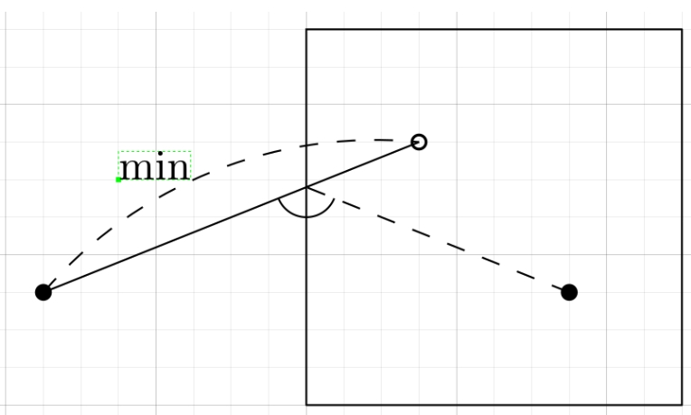

# 문제 링크

[당구 연습](https://school.programmers.co.kr/learn/courses/30/lessons/169198)

# 1. 내 풀이

```js
function solution(m, n, startX, startY, balls) {
  var answer = [];
  const sym = [
    [startX, 2 * n - startY],
    [2 * m - startX, startY],
    [startX, -startY],
    [-startX, startY],
  ]; // 상우하좌 시작점의 대칭점을 미리 구한다

  balls.forEach(([targetX, targetY]) => {
    let min = Infinity;
    // 각 시작대칭점과 목표점을 비교한다.
    for (const [newStartX, newStartY] of sym) {
      // 시작대칭점과 목표점의 x가 같은 경우
      if (newStartX === targetX) {
        const maxY = Math.max(startY, newStartY);
        const minY = Math.min(startY, newStartY);
        // 벽을 먼저 칠 수 없으면 스킵
        if (minY < targetY && targetY < maxY) continue;
      }
      // 시작점 대칭점과 목표점의 y가 같은 경우
      if (newStartY === targetY) {
        const maxX = Math.max(startX, newStartX);
        const minX = Math.min(startX, newStartX);
        if (minX < targetX && targetX < maxX) continue;
      }
      const result = (newStartX - targetX) ** 2 + (newStartY - targetY) ** 2; // 거리를 구한다.
      min = Math.min(min, result); // 최소거리 갱신
    }
    answer.push(min);
  });
  return answer;
}
```

## 풀이 방법

### 문제정리

- 가로 길이 m, 세로 길이 n
- (0, 0)기준은 좌측하단
- 벽에 한 번 맞힌 후 공에 맞히는게 원쿠션 (목표 공보다 벽을 먼저 맞춰야 함)
- 입사각과 반사각이 동일
- 공이 목표 공에 맞으면 바로 멈춘다
- 머쓱이가 친 공이 굴러간 거리의 최솟값의 제곱

### 풀이

- 시작점의 4방향을 구한다. [newStartX, newStartY]
- balls를 순회하며 4방향마다 각 공이 움직이는 거리를 비교하며 최소값을 구한다.
  - 목표공의 x와 대칭점의 newStartX가 같은 경우 벽을 먼저 부딪히지 않는 경우는 스킵한다. (원쿠션이여야한다)
  - 목표공의 y와 대칭점의 newStartY가 같은 경우 벽을 먼저 부딪히지 않는 경우는 스킵한다.
- 벽을 먼저 부딪히지 확인하는 법
  - 목표공의 x가 startX와 대칭점 newStartX사이에 있다면 벽을 먼저 부딪힐 수 없다
  - 목표공의 y가 startY와 대칭점 newStartY사이에 있다면 벽을 먼저 부딪힐 수 없다
  - 그 외의 경우에는 목표점과 대칭점 사이의 거리를 구해 최소값을 갱신한다.

# 2. 느낀 점

고민하다가 못 풀어서 다른 분의 풀이를 참고했습니다.

# 3. 배운 점

- 대칭점을 이용하여 두 점 사이의 거리를 구할 수 있다
  
